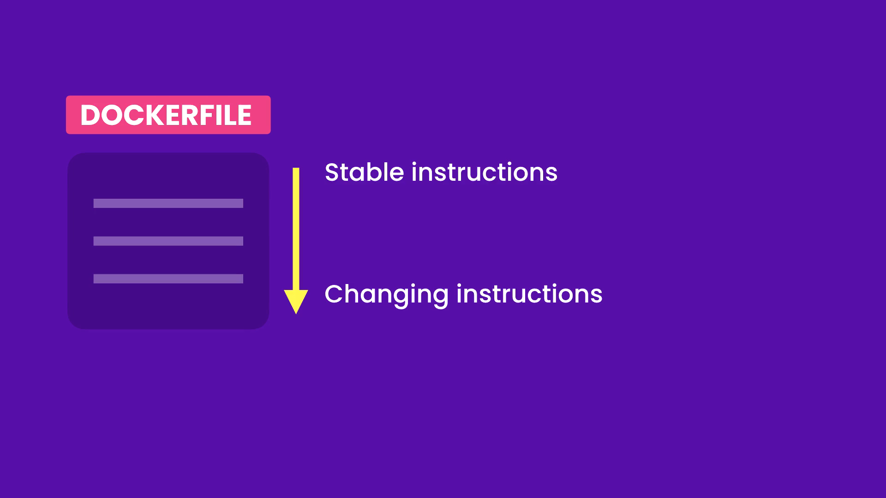

# Building Images

## Images and Containers

An image includes everything an application needs to run:

- a cut-down OS
- third-party libraries
- application files
- environment variables
- and much more

A container is like a virtual-machine:

- provides an isolated environment for executing an application
- can be stopped and restarted
- is just a precess

## Dockerfile Instructions

A Dockerfile contains instructions for building an image

- FROM
- WORKDIR
- COPY
- ADD
- RUN
- ENV
- EXPOSE
- USER
- CMD
- ENTRYPOINT

## Choosing the Right Base Image

**FROM** is used to specify the base image it can be an OS or an OS plus a runtime environment.
for example if you're a python developer you start with **Python** image or **Node** image for Javascript developer.

Don't blindly choose images always do your research

**Note**: `FROM node:latest` do not use **latest** tag, once you're done with your project there might be another new version for the base image and that has the potential to cause problems than good.

there might be different builds for the base image based on the OS and CPU architecture, you don't need to worry about it since **docker** takes care of that and when you pull an image it automatically chooses the right one.

### Searching for a Base image

1. Go to DockerHub and search for the base image like "node" and "python"
2. Click on the official image
3. Select the tags tab and filter the images based on subsystem link "alpine", "arch"
4. Choose the one you are happy with "docker pull node:23.3.0-alpine3.20" but don't execute it right away
5. In you're **Dockerfile** use this part **node:23.3.0-alpine3.20** like so `FROM node:23.3.0-alpine3.20`

### Building an Image

After choosing the base image and versions with this command in your Dockerfile `FROM node:23.3.0-alpine3.20`, open up terminal and run `docker build -t react-app .`

- `docker build` to build an image
- `-t react-app` to give it a tag **react-app**
- `.` is the path to **Dockerfile** in our case it's in our current directory

**Note**: Make sure **docker desktop** is open and **docker engine** is running!

when you run the above command docker downloads the files and build your image.

you can check that by running `docker image ls` or `docker images`

```bash
PS D:\Courses\Docker\docker-learning\react-app> docker images
REPOSITORY         TAG       IMAGE ID       CREATED       SIZE
react-app          latest    3bce6930aaa0   12 days ago   161MB
hello-docker-new   latest    8c4284648ad1   6 weeks ago   158MB
hello-docker       latest    ee4aa78d435d   6 weeks ago   158MB
ubuntu             latest    59ab366372d5   7 weeks ago   78.1MB
```

### Running the Image

To run the image you execute `docker run -it react-app` to open it up in the interactive mode.
but that opens a **Node** environment which you can write Js code and will be executed just like the **Browser console** and it's not what we want, we want to start our react-app.

at the end of run command we can specify the command to run when starting this container,
run `docker run -it react-app bash` here we want to run **bash**, which throws the following error

```bash
PS D:\Courses\Docker\docker-learning\react-app> docker run -it react-app bash
node:internal/modules/cjs/loader:1242
  throw err;
  ^

Error: Cannot find module '/bash'
    at Function._resolveFilename (node:internal/modules/cjs/loader:1239:15)
    at Function._load (node:internal/modules/cjs/loader:1064:27)
    at TracingChannel.traceSync (node:diagnostics_channel:322:14)
    at wrapModuleLoad (node:internal/modules/cjs/loader:218:24)
    at Function.executeUserEntryPoint [as runMain] (node:internal/modules/run_main:170:5)
    at node:internal/main/run_main_module:36:49 {
  code: 'MODULE_NOT_FOUND',
  requireStack: []
}

Node.js v23.3.0

```

and that is because **alpine linux** is very small distribution and doesn't come with bash installed. instead run `docker run -it react-app sh` to open **shell** which is standard for all linux distributions.

here is the result and we can check Node version

```bash
PS D:\Courses\Docker\docker-learning\react-app> docker run -it react-app sh
/ # ls
bin    dev    etc    home   lib    media  mnt    opt    proc   root   run    sbin   srv    sys    tmp    usr    var
/ # node --version
v23.3.0
/ #
```

but we don't have our application files! yet.

## Copying Files and Directories

Now that we have a base image we need to copy our application files into the image, so for that we have `COPY` and `ADD` they have the same syntax but `ADD` has a couple more features.

`COPY` with this we can copy one or more files/directories from current directory into the image. wa can't copy files/directories from outside current directory (where the Dockerfile is located).

that is because in `docker build -t react-app .` command we used `.` (current directory), when we run this command **docker client** sends the contents of **current directory** to **docker engine** which is called `build context`, so **docker client** sends **build context** to **docker engine** and then **docker engine** start executing commands inside **Dockerfile** one by one, this way docker engine does't have access to the files/directories outside this directory.

```Dockerfile
FROM node:23.3.0-alpine3.20
# -------------------------- about source -------------------------
# Copy files or folders from source to the dest path in the image's filesystem.
# COPY source dest

# copying package.json into /app directory in image's filesystem, will be created if doesn't exist
COPY package.json /app

# When using COPY with more than one source file, the destination must be a directory and end with a / or a \
COPY package.json README.md /app/

# Or use a pattern
COPY package*.json /app

# Copy all files and directories from source to dest
COPY . /app
# ------------------------------ about destination ----------------------

# here we use absolute path "/app" for the destination
COPY . /app

# we can only use relative path when the "WORKDIR" is set
# when you set WORKDIR all the instruction coming after this will be executed inside this working directory
WORKDIR /app
# copy all files/directories from current working directory into "/app" working directory
COPY . .

Note: if the file name has space like (hello world.txt) we should use this syntax ["","",""]
where each string represents an argument of COPY command, `COPY ["hello world.txt", "."]`

COPY ["hello world.txt", "."]
```

we also have ADD command

```Dockerfile
FROM node:23.3.0-alpine3.20
WORKDIR /app
# add a file from a URL, if you have access to it
ADD http://.../file.txt .

# the other feature is that you can add a compressed file and ADD will extracted it
ADD file.zip .
```

**Note**: It's best to use **COPY** command over **ADD** unless you need to add a file from a URL or add a compressed file.

Now run

```bash
PS D:\Courses\Docker\docker-learning\react-app> docker run -it react-app sh
/app # ls
Dockerfile         eslint.config.js   node_modules       package.json       src
README.md          index.html         package-lock.json  public             vite.config.js
/app #
```

## Excluding Files and Directories

When building docker images there are files that doesn't need to be included in the built image, mostly because it can be easily generated in any machine and to speed up our build and deployment process. meet `.dockerignore` file containing all the files and directories to be excluded, it should be in the root directory of your project just like `.gitignore` file.

```dockerignore
node_modules
```

now that we have `.dockerignore` file excluding `node_modules` run `docker build -t react-app .` to build our image without `node_modules` (the size is significantly reduced).

now we need to run `docker run -it react-app sh` and then in the shell session run `npm install` to install all the dependencies, since we excluded the `.dockerignore` file.

## Running Commands

Now to install our dependencies we should include `RUN` command in our Dockerfile

```dockerfile
FROM node:23.3.0-alpine3.20
WORKDIR /app
COPY . .
RUN npm install

```

basically wit `RUN` command we can run any command we could in `terminal`,

```dockerfile
FROM node:23.3.0-alpine3.20
WORKDIR /app
COPY . .
RUN npm install
RUN apt install python -> in case you need to install another package

```

**Note**: alpine distro doesn't have `apt` instead it has `apk` and here is a few commands:

```bash
apk add python3 -> install python version 3
apk update -> to update the installer resources if the installer package is not available
apk add python3 -> run again to install
python3 --version -> check if the package installed successfully
```

but for our react-app project this is the Dockerfile

```dockerfile
FROM node:23.3.0-alpine3.20
WORKDIR /app
COPY . .
RUN npm install
```

## Setting Environment Variables

Quite often we need to define environment variables in our app and you can do so with `ENV`
command in Dockerfile.

```dockerfile
FROM node:23.3.0-alpine3.20
WORKDIR /app
COPY . .
RUN npm install
# new syntax
ENV API_URL=http://api/myapp.com
# old syntax
ENV API_URL http://api/myapp.com

```

**Note**: use the new syntax for defining environment variables to be clear.

now run `docker build -t react-app .` to build our app again

```bash
PS D:\Courses\Docker\docker-learning\react-app> docker run -it react-app sh
/app # printenv
NODE_VERSION=23.3.0
HOSTNAME=fdfe17510384
YARN_VERSION=1.22.22
SHLVL=2
HOME=/root
TERM=xterm
PATH=/usr/local/sbin:/usr/local/bin:/usr/sbin:/usr/bin:/sbin:/bin
PWD=/app
API_URL=http://api/myapp.com
/app # printenv API_URL
http://api/myapp.com
/app # echo $API_URL
http://api/myapp.com
```

and as above our environment variable is set for us.

## Exposing Ports

when we run our `react-app` as usual we get `http://localhost:5173`, 5173 port is open to the host (our windows PC) but when we run this app's docker image that port will be open to the container not to the host, basically we can't view the output as usual.

this behavior is useful when we have multiple containers running the same image.

In this situation we need to `EXPOSE` the `5173` port from our container to the host. but this port is not going to be mapped to the host automatically, we need to map it.

first we need to add `EXPOSE` to our dockerfile, to tell what port this container will be listening on.

```dockerfile
FROM node:23.3.0-alpine3.20
WORKDIR /app
COPY . .
RUN npm install
ENV API_URL=http://api/myapp.com
EXPOSE 5173
```

`EXPOSE` command doesn't publish the port on the host, is just a form of documentation that tells us which port this container will eventually be listening on.

## Setting the User

By default Docker runs our applications on the root user with the most privileges, this can open up security holes in our system, to prevent this we need to create a normal user with limited privileges.

create a system user (system users have limited privileges and used for running background precesses), and a group for that user.

```dockerfile
RUN addgroup -S app && adduser -S -G app app
```

then to switch the user use

```dockerfile
USER app
```

all the following commands will be executed using this user.

## Defining Entrypoints

Issue with `permission error`

The issue is likely due to the order of commands and how file permissions are handled when the `USER appuser` command is used early in the `Dockerfile`. Here's a breakdown of why your instructor's solution might work in some cases but not in others (like yours).

---

### **Why This Happens**

1. **When `USER appuser` Is Defined Early**:

   - The `WORKDIR /app` command creates the `/app` directory **owned by `appuser`** because the `USER appuser` is already active at that point.
   - However, the `COPY . .` command copies files into `/app`, and the default behavior assigns them to `root`, leaving `appuser` without write permissions.

2. **Why It Worked for Your Instructor**:

   - If their setup ensures the `COPY` step does not overwrite permissions (e.g., because of build cache or host system configuration), the issue might not occur.
   - Alternatively, their `npm install` step might not require creating or modifying files (e.g., if they skipped the `package-lock.json` update due to caching).

3. **Why It Fails for You**:
   - In your case, the `COPY . .` step assigns files to `root`, and `appuser` cannot write to them, causing the `npm install` step to fail.

---

### **The Fix**

To ensure consistent behavior, explicitly adjust permissions **after copying the files**. Here's the corrected `Dockerfile`:

```dockerfile
FROM node:23.3.0-alpine3.20

# Create non-root user and group
RUN addgroup -S appgroup && adduser -S appuser -G appgroup

# Switch to the non-root user
USER appuser

# Set the working directory (created as appuser)
WORKDIR /app

# Switch back to root temporarily for the next steps
USER root

# Copy project files and fix permissions
COPY . .
RUN chown -R appuser:appgroup /app

# Switch back to non-root user
USER appuser

# Install dependencies
RUN npm install

# Set environment variables
ENV API_URL=http://api/myapp.com

# Expose the app port
EXPOSE 3000

# Start the application
CMD ["npm", "start"]
```

---

### **Why This Works**

1. **Permissions Are Adjusted After `COPY`**:

   - The `RUN chown -R appuser:appgroup /app` command ensures all files and directories in `/app` are owned by `appuser`.

2. **Explicit User Switching**:
   - Switching to `USER root` ensures the `COPY` command and `chown` have sufficient permissions.
   - Switching back to `USER appuser` ensures the app runs securely as a non-root user.

---

### **Best Practices**

- Always verify file permissions when copying files into the container.
- Use the `USER` command strategically to avoid unnecessary permission issues.

---

### **Troubleshooting Tips**

1. **Inspect Permissions in the Built Image**:
   Run a shell in the built container to check file ownership:

   ```bash
   docker run -it --rm <image_name> sh
   ls -l /app
   ```

2. **Rebuild Without Cache**:
   If caching causes inconsistent behavior, rebuild the image without using cached layers:

   ```bash
   docker build --no-cache -t react-app .
   ```

---

for now we need to run `docker run react-app npm run dev` in the terminal every time we run our app, which is not ideal and here is the `CMD` command (COMMAND) to run commands in the terminal.

```dockerfile

CMD npm start
# or
CMD npm run dev
```

**Note**: the `CMD` instruction is just to supply the default command, it doesn't make sense to have multiple `CMD` instructions in the dockerfile, even if you supply multiple `CMD` commands only the last one will take effect!

### CMD vs RUN

`RUN` is a build-time instruction, executed at the time of building the image.

`CMD` is a run-time instruction, so it is executed when starting a container.

`CMD` instruction has two forms:

```dockerfile
# shell form
CMD npm start

# Execute form
CMD ["npm", "start"]
```

if you use `shell-form` that command will be executed in a separate shell, but with the `exec-form` we can execute the commands without spinning up another shell session.

here is `ENTRYPOINT` instruction which works similar to `CMD` instruction this this difference that you can't override it, if you need to do so use `--entrypoint` flag.

```dockerfile
ENTRYPOINT [ "npm", "run", "dev" ]
```

```bash


```

`ENTRYPOINT` is used when you know for sure that is the command to be executed whenever we start a container. with the `CMD` instruction we have a bit of flexibility that we can override it without providing any additional flags.

which one to use! it's just the matter of personal preference.

## Speeding Up Builds

### Layers in Docker

In Docker, **layers** are an essential concept that form the foundation of how Docker images are built, stored, and shared. Here's an explanation of what layers are and how they work:

---

### **What are Layers in Docker?**

A **layer** is a component of a Docker image. Each layer represents a set of changes made to the file system, such as adding, modifying, or deleting files.

- When you create a Docker image using a `Dockerfile`, each instruction in the `Dockerfile` creates a new layer.
- Layers are **stacked** on top of each other to form the final image.

---

### **Key Features of Docker Layers**

1. **Immutable**  
   Once a layer is created, it cannot be modified. If you make changes, a new layer is created.

2. **Reusability**  
   Docker reuses unchanged layers across builds. If you modify only the topmost instruction in your `Dockerfile`, Docker reuses the previous layers, speeding up the build process.

3. **Layer Caching**  
   Docker caches layers locally, allowing it to skip rebuilding steps that haven’t changed. This is why the order of instructions in your `Dockerfile` affects build performance.

4. **Shared Between Images**  
   Layers are stored in a shared storage system on your Docker host. If multiple images use the same base image or identical instructions, they share those layers, saving space.

---

### **How Layers Work in a Dockerfile**

Each instruction in a `Dockerfile` (e.g., `FROM`, `RUN`, `COPY`) creates a layer.

**Example `Dockerfile`:**

```dockerfile
# First Layer: Base image
FROM node:18

# Second Layer: Set working directory
WORKDIR /app

# Third Layer: Copy package files and install dependencies
COPY package.json package-lock.json ./
RUN npm install

# Fourth Layer: Copy application source code
COPY . .

# Fifth Layer: Expose port and start application
EXPOSE 3000
CMD ["npm", "start"]
```

For this Dockerfile:

1. **Layer 1:** The `node:18` base image is pulled and forms the first layer.
2. **Layer 2:** The working directory is set to `/app`.
3. **Layer 3:** Dependencies are installed.
4. **Layer 4:** Application source code is copied.
5. **Layer 5:** The container is configured to expose port `3000` and run `npm start`.

---

### **Caching and Layers**

When building an image, Docker checks if a layer can be reused from cache by comparing:

1. The **instruction** in the `Dockerfile`.
2. The **contents of the files** used by that instruction.

**Example of Cache Use:**

- If `COPY package.json .` hasn't changed, the cached layer with installed dependencies (`RUN npm install`) is reused.
- If you modify `package.json`, the cache for that layer and subsequent layers is invalidated.

---

### **Final Image**

The final Docker image is a combination of all the layers. During container runtime:

- Layers are **read-only**.
- A **writable layer** is added on top of the image for runtime modifications. This writable layer is not persisted when the container stops.

---

### **Benefits of Layered Architecture**

1. **Efficiency:**

   - Shared layers reduce disk usage and build time.
   - Layers can be reused across multiple images.

2. **Modularity:**

   - You can build images in stages and share common layers between images.

3. **Speed:**
   - Caching makes subsequent builds significantly faster.

---



## Removing Images and Containers

Removing Docker images and containers is a common maintenance task to free up disk space and keep your Docker environment clean. Here’s an explanation:

---

### **1. Removing Docker Containers**

A Docker container is a running or stopped instance of an image. To remove a container:

#### **View All Containers**

Use this command to list all containers:

```bash
docker ps -a
```

#### **Remove a Specific Container**

Use the container's ID or name:

```bash
docker rm <container_id_or_name>
```

#### **Remove All Stopped Containers**

You can quickly remove all containers that are not running:

```bash
docker container prune
```

- You’ll be prompted for confirmation.

---

### **2. Removing Docker Images**

A Docker image is the blueprint used to create containers. To remove unused or outdated images:

#### **View All Images**

List all images:

```bash
docker images
```

#### **Remove a Specific Image**

Use the image's ID or repository name and tag:

```bash
docker rmi <image_id_or_name>
```

#### **Remove Dangling Images**

Dangling images are untagged images (intermediate layers) that are no longer referenced by any container:

```bash
docker image prune
```

- You’ll be prompted for confirmation.

#### **Remove All Unused Images**

This removes all images not associated with a container:

```bash
docker image prune -a
```

- Use this with caution to avoid deleting images you might need.

---

### **3. Combining Commands**

#### **Remove Containers and Images Together**

You can use `docker system prune` to remove all unused containers, images, networks, and caches:

```bash
docker system prune
```

#### **Remove Everything (For Cleanup)**

To remove unused items, including volumes (which aren’t removed by default), use:

```bash
docker system prune -a --volumes
```

---

### **Things to Note**

1. **Dependency Restrictions**:
   - You cannot remove an image if containers are using it. Stop and remove the container first.
2. **Careful Pruning**:
   - Pruning commands can remove data you may want to keep, so use them thoughtfully.
3. **Saved Space**:
   - Running `docker system df` shows how much space is used by images, containers, and volumes.

## Tagging Images

Tagging in Docker is a way to manage and identify different versions of Docker images. Tags provide a human-readable label that corresponds to a specific image, helping developers and system administrators organize and differentiate between various builds, versions, or configurations of an image.

### **1. What is a Docker Tag?**

- A Docker tag is an alias attached to an image that points to a specific image ID (a SHA-256 hash).
- Tags are primarily used to version and categorize images.

For example:

```bash
myapp:1.0.0
```

In this example:

- `myapp` is the name of the image.
- `1.0.0` is the tag.

If no tag is specified, Docker defaults to the `latest` tag:

```bash
myapp:latest
```

### **2. How Tags Work**

Each tag is essentially a pointer to a specific image layer or set of layers. Even if two tags are different, they can refer to the same image. This allows you to assign multiple tags to one image or reuse tags to point to updated versions.

### **3. Why is Tagging Important?**

- **Version Control**: Tags let you specify and track image versions (e.g., `1.0.0`, `1.0.1`).
- **Environment-Specific Images**: You can tag images for different environments (e.g., `dev`, `staging`, `prod`).
- **Easy Collaboration**: Tags make it easier for teams to know which image to use.
- **Continuous Delivery Pipelines**: Tags like `latest`, `stable`, or specific commit hashes help automate CI/CD workflows.

---

### **4. Tagging an Image**

You can tag an image explicitly during the build process or re-tag an existing image.

#### **4.1 Tagging During Build**

When you build an image, you can assign it a tag using the `-t` flag:

```bash
docker build -t myapp:1.0.0 .
```

This command:

- Builds the Dockerfile in the current directory (`.`).
- Assigns the tag `myapp:1.0.0` to the resulting image.

#### **4.2 Tagging an Existing Image**

To add or change a tag for an existing image, use the `docker tag` command:

```bash
docker tag <source-image> <target-image>
```

For example:

```bash
docker tag myapp:1.0.0 myapp:latest
```

This creates a new `latest` tag pointing to the same image as `1.0.0`.

---

### **5. Pushing Tagged Images to a Registry**

Tags play a significant role when pushing images to a Docker registry like Docker Hub, AWS ECR, or a private registry.

#### **5.1 Push an Image with a Specific Tag**

```bash
docker push username/myapp:1.0.0
```

- `username/myapp` is the repository name.
- `1.0.0` is the tag.

#### **5.2 Push the Default Tag (`latest`)**

If no tag is specified, Docker pushes the `latest` tag:

```bash
docker push username/myapp
```

---

### **6. Listing Tags**

Docker does not have a direct command to list all tags for an image. However, you can check the tags for a repository on a Docker registry using the registry's web interface or APIs.

---

### **7. Tagging Strategies**

#### **7.1 Semantic Versioning**

Use semantic versioning to indicate changes:

- `1.0.0` (major release with breaking changes)
- `1.0.1` (minor update with no breaking changes)
- `1.1.0` (new feature without breaking changes)

#### **7.2 Environment Tags**

Tag images based on their environment:

- `myapp:dev`
- `myapp:staging`
- `myapp:prod`

#### **7.3 CI/CD Tags**

Use tags that align with your CI/CD pipeline:

- Commit SHA: `myapp:abc1234`
- Build number: `myapp:build-42`

#### **7.4 Rolling Tags**

Update tags like `latest` or `stable` to point to newer versions, but maintain version-specific tags like `1.0.0` for rollback purposes.

---

### **8. Removing Tags**

Tags are just aliases; deleting a tag does not delete the underlying image. To remove a tag:

```bash
docker rmi <image:tag>
```

For example:

```bash
docker rmi myapp:1.0.0
```

If no other tags point to the image, the image will also be removed.

---

### **9. Best Practices**

1. **Avoid Using `latest` in Production**: The `latest` tag is mutable and can point to different images over time, leading to unpredictability.
2. **Use Immutable Tags**: Always use specific version numbers for production deployments.
3. **Document Your Tagging Strategy**: Clearly define and communicate your team's tagging strategy.
4. **Automate Tagging**: Integrate tagging into your CI/CD pipeline to ensure consistency.

---

### **10. Visualizing Tags**

Think of tags as sticky notes attached to a file. You can attach multiple sticky notes (tags) to one file (image), and removing a sticky note doesn't delete the file unless no other sticky notes remain.

---

Let me know if you'd like more examples or details!
